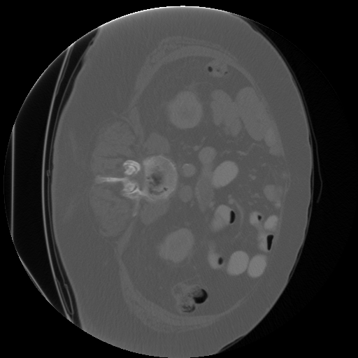
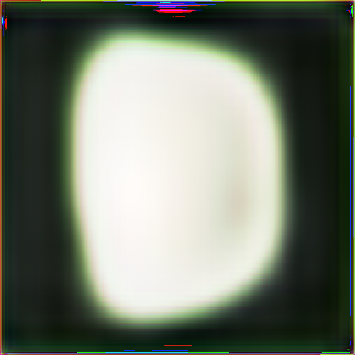
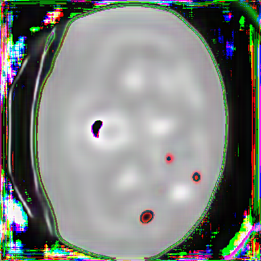

# SEGMENTACIÓN DE IMÁGENES DE BAZOS PARA LA DETECCIÓN DE TUMORES

## Datos del curso 📘

 **Proyecto final**
* **Curso: Computación Gráfica**
* **Clase del 2020-1**
* **Maestría en informática - Mención en ciencias de la computación**

## Resumen 🎯
La detección de tumores en radiografías, siempre ha sido un desafío para las redes actuales que buscan la segmentación de este tipo de imágenes, actualmente existen investigaciones de segmentación en escala de grises. Esta investigación propone una segmentación a colores, para la detección de posibles tumores en la imagen. Para lograr esto se procesa las imágenes de Bazos obtenidos de "Medical Segmentation Decathlon" y se hace uso del modelo ResNet152 pre-entrenada en escala de grises para la clasificación de mamografías. Nuestro método propuesto puede segmentar las imágenes a colores con cierto porcentaje de ruido. Mostramos que también se puede realizar segmentación a color de imágenes médicas en base a modelos pre entrenados en escala de grises.

 
    

## Arquitectura y estructura de archivos 🏢

El proyecto cuentas con las siguientes carpetas:

📁 Visualization ([Ver](/Visualization)) .- Contiene los scripts para para extraer las imágenes de cortes de las ecografías del dataset original [MedicalSegmentationDecathlon](http://medicaldecathlon.com/). Para el proyecto en particular se escogío la partición del dataset que corresponde a ecografías de bazos [SpleenDataset](https://drive.google.com/file/d/1jzeNU1EKnK81PyTsrx0ujfNl-t0Jo8uE/view?usp=sharing).

 
    <h5>Imagen correspondiente al dataset original</h1>
    

📁 Set Generation ([Ver](/Set%20Generation)) .- Contienen los scripts hechos en jupyter notebooks para generar el set de entrenamiento compuesto de imágenes originales e imágenes etiquetadas. Se destacan las funciones para el etiquetado de imágenes que utiliza la librería [OpenCV](https://opencv.org/). El etiquetado automático simula el etiquetado realizado por especialistas en un eventual proyecto similar destinado a producción.

 
    <h5>Imagen original</h5>
    

 
    <h5>Imagen etiquetada</h5>
    

📁 Data .- En esta carpeta se recomienda almacenar los siguientes archivos : 
- Imágenes del set de entrenamiento [Descargar](https://drive.google.com/file/d/12ELJm48gudZApmxozqqeg4JL5HInDauU/view?usp=sharing)
- Imágenes del set de válidacion [Descargar](https://drive.google.com/file/d/12KR_l0TgLhwc3J25GFUkd9S73OEtphG_/view?usp=sharing)
- Imágenes etiquetadas del set de entrenamiento [Descargar](https://drive.google.com/file/d/12N6rBvzncffWGx2AjtJ8BAgPw4lQ__xz/view?usp=sharing)
- Modelo preentrenado en el proyecto [Descargar](https://drive.google.com/file/d/1vlLGX3Lx8q-rH-rxNqVvxRKNWaSxn9i9/view?usp=sharing)

📁 Training ([Ver](/Training)) .- Contienen los experimentos hechos en jupyter notebooks donde se va construyendo y definiendo nuestro modelo final. El script donde se define nuestro modelo final puede ser accedido en el siguiente [Enlace](/Training/Entrenamiento_Images_v3(FINAL).ipynb). Nuestro modelo final tiene como base un modelo preentrenado ResNet152 que puede ser descargado del siguiente [Enlace](http://data.csail.mit.edu/places/medical/pretrained/2class/resnet152/checkpoint_00000005.pth.tar) y corresponde al proyecto [DDSM-VISUAL-PRIMITIVES](https://github.com/jimmyyhwu/ddsm-visual-primitives). Nuestro proyecto amplia la red neuronal preentrenada de modo que en base a las imágenes originales de ecografías en blanco y negro se generen las imágenes etiquetadas de forma similar a las etiquetadas correspondientes. A continuación se muestra los resultados: 

 
    <h5>Imagen dada al modelo</h5>
    

 
    <h5>Imagen obtenida como resultado tras 1 época</h5>
    

 
    <h5>Imagen obtenida como resultado tras 3 épocas</h5>
    

📁 Results ([Ver](/Results)) .- En esta carpeta se almacenan las imágenes que se obtuvieron como resultado de los experimentos y el script de visualización de los resultados finales que se puede ver en el siguiente [Enlace](/Results/Resultados.ipynb). Nuestro modelo final se carga de la nube.

## Pasos para la ejecución (Jupyther Notebook - Colab) 📑🐍

- Copiar el archivo (XYZ.ipynb) correspondiente a cualquier cuaderno que quiera ejecutar a Google Drive.
- Abrir el archivo con la herramienta COLAB.
- Activamos el GPU dentro de la herramienta.
- Ejecutar el cuardeno (El archivo debe ya contar con las fases de descarga y descompresión de datasets y modelos usados por los cuadernos).

## Autores 💻

 
    
    <h1>ESCUELA DE POSGRADO</h1>

* **Jose Ulises Morales Pariona** - [Github](https://github.com/ulises968)

* **Juan Manuel Mendoza Jacinto** - [Linkedin](https://pe.linkedin.com/in/juan-manuel-mendoza-jacinto-18515ab0) - [Github](https://github.com/fararay)

* **Alex Blainer Sanchez Sanchez** - [Linkedin](https://www.linkedin.com/in/alex-sanchez-sanchez/?originalSubdomain=pe) - [Github](https://github.com/alexssanchez)

## Licencia 📄

La licencia de este proyecto es del tipo **GNU General Public License v3.0** ([Ver](LICENSE.md))

